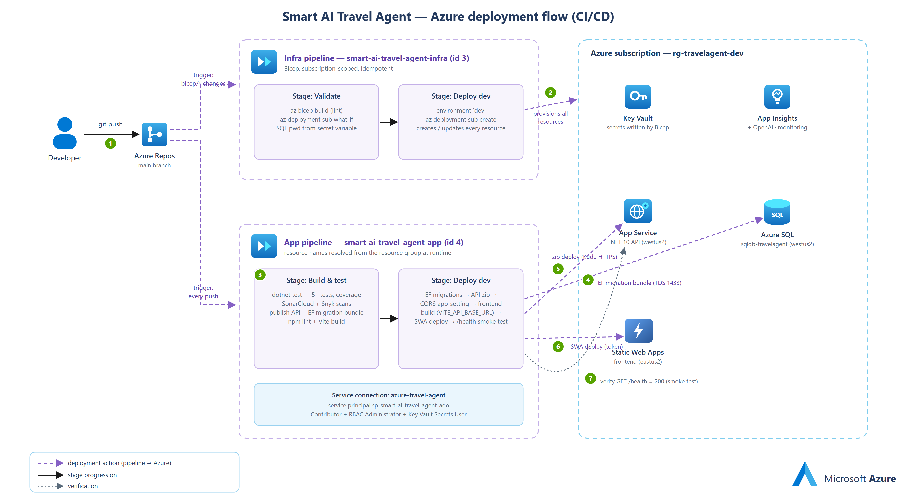
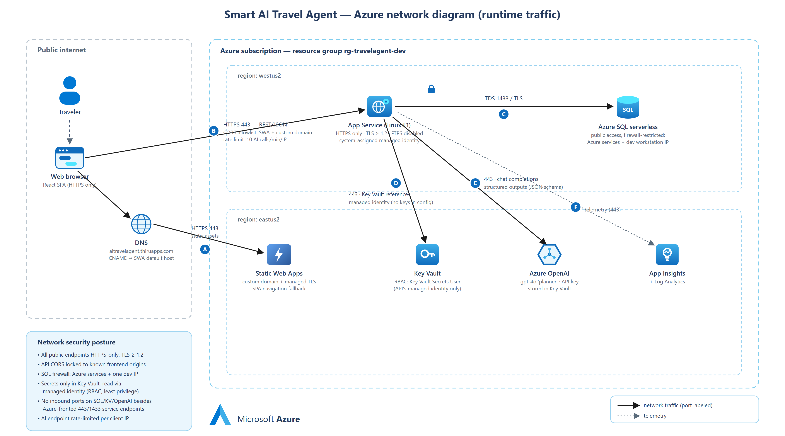

# Smart AI Travel Agent — Design Gallery

Visual documentation of the system: UML models of the code and data, plus
Azure icon-style flow diagrams of the architecture, deployment, and network.
Every image links to its scalable SVG; editable sources and regeneration
instructions are in the [README](README.md).

---

## Class Diagram

Key entities with attributes, service interfaces with method signatures, and
the relationships between them (composition, realization, dependencies).

---

## Entity-Relationship Diagram

Database tables, columns with SQL types, primary/foreign/unique keys, and
crow's-foot cardinality with cascade-delete behavior.

---

## Azure Architecture Flow

The system in the flat Microsoft Azure icon style: traveler → Static Web Apps →
App Service API → Azure OpenAI + SQL, with the platform services row
(Key Vault, App Insights, DevOps) and the trip-experience outcomes,
numbered steps ①–⑤.

---

## Azure Sequence Flow

Sequence semantics (lifelines, activation bars, calls vs. returns) with
Azure-icon participants and numbered steps ①–⑧ for the planning flow, plus
the chat-refinement loop band.

---

## Azure Deployment Flow (CI/CD)

git push → CI triggers → both pipelines with their stages spelled out
(Bicep lint/what-if/deploy; build + tests + Sonar/Snyk; migrations → API zip →
CORS → SWA → smoke test), the service-connection identity, and numbered
deployment actions ①–⑦ into the resource group.

---

## Azure Network Diagram (runtime)

Public-internet boundary, DNS/CNAME resolution, flows Ⓐ–Ⓕ with ports and
protocols (443 everywhere, TDS 1433/TLS to SQL), CORS and rate-limit
annotations, the westus2/eastus2 split, and a network security posture panel.

