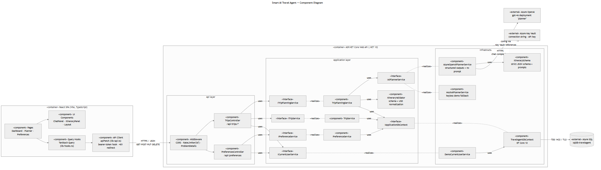
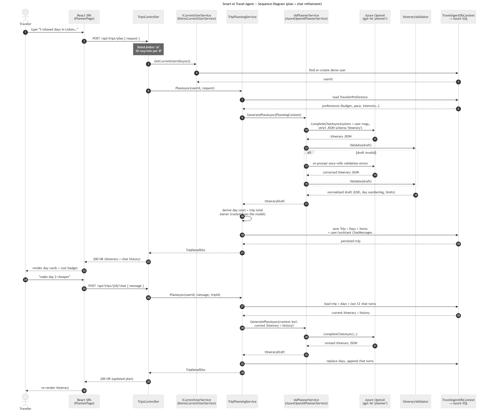
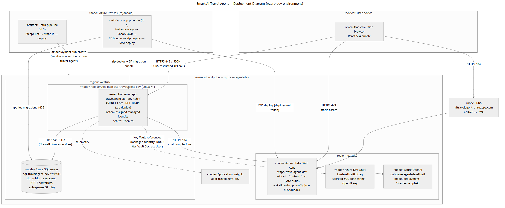
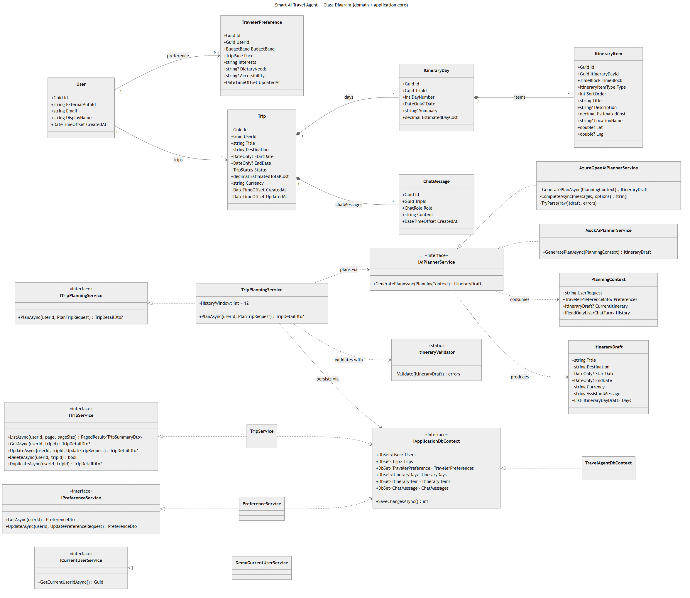
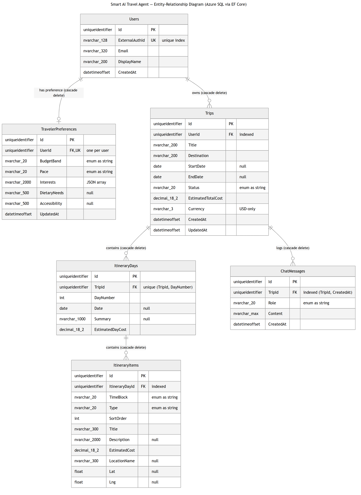
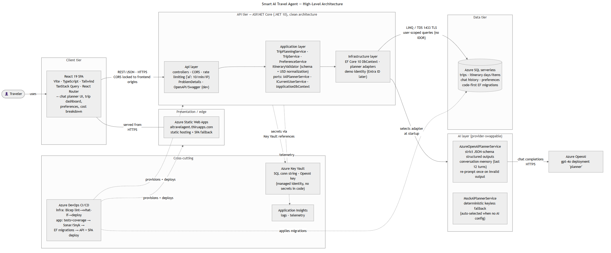
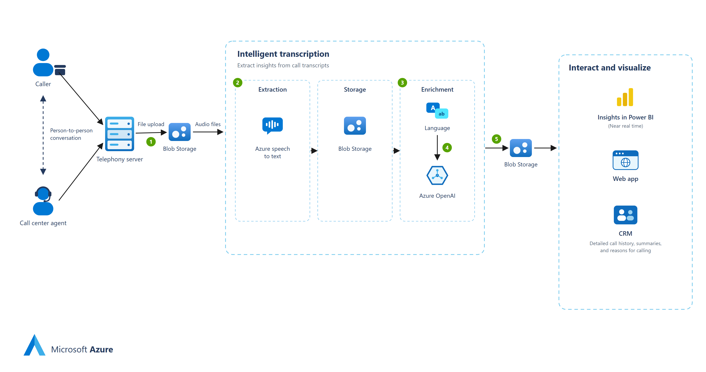
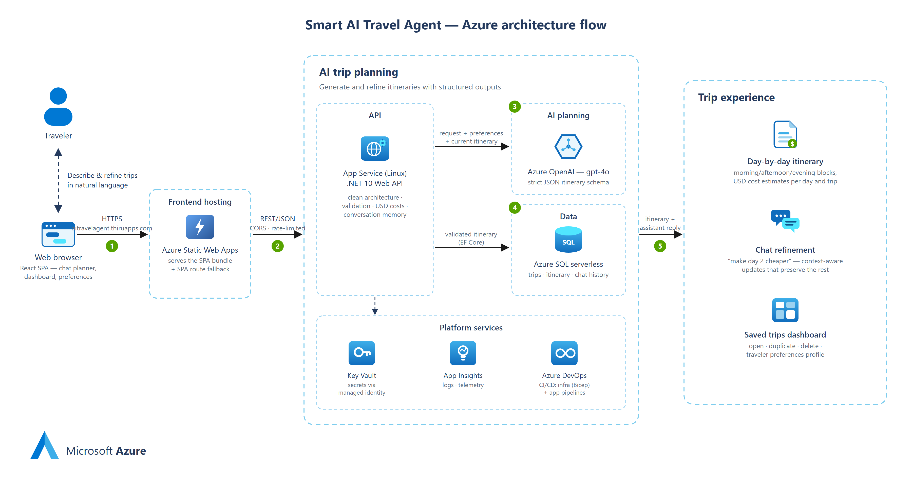
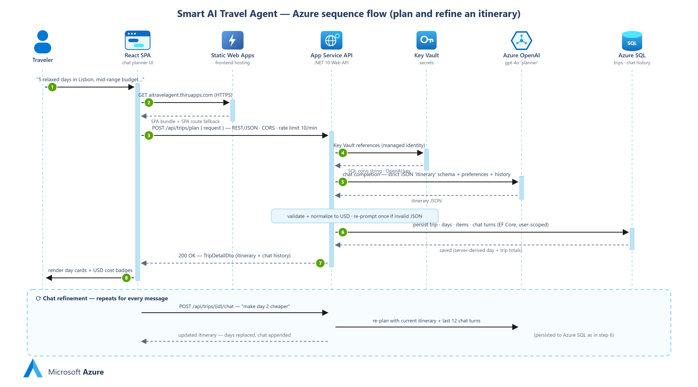
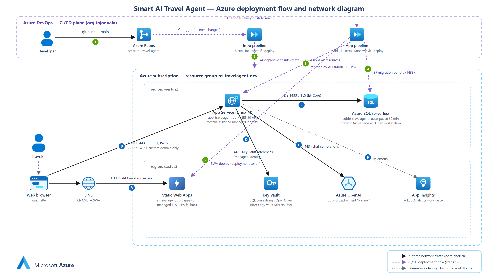

# Smart AI Travel Agent — Design Gallery

Visual documentation of the system, from UML models to Azure icon-style flow
diagrams. Every image links to its scalable SVG; editable sources and
regeneration instructions are in the [README](README.md).

---

## 1. Component Diagram

Main modules, their interfaces, and dependencies: React SPA components, the
clean-architecture API layers (controllers → application services →
infrastructure adapters), and the external Azure services.

---

## 2. Sequence Diagram (UML)

The plan + chat-refinement request/response flow with actors, objects, and
message ordering — including the validate/re-prompt branch and server-side
cost derivation.

---

## 3. Deployment Diagram (UML)

Physical nodes of the Azure dev environment: what runs where, regions, and
every network connection with its protocol.

---

## 4. Class Diagram

Key entities with attributes, service interfaces with method signatures, and
the relationships between them (composition, realization, dependencies).

---

## 5. Entity-Relationship Diagram

Database tables, columns with SQL types, primary/foreign/unique keys, and
crow's-foot cardinality with cascade-delete behavior.

---

## 6. High-Level Architecture

The one-page big picture: client, edge, API, AI, and data tiers plus
cross-cutting concerns (Key Vault, App Insights, CI/CD).

---

## 7. Call-Center Analytics Pipeline (Azure icon style)

Reference diagram in the flat Microsoft Azure aesthetic: call capture →
intelligent transcription (speech-to-text, Language, Azure OpenAI) →
interaction and visualization.

---

## 8. Travel Agent — Azure Architecture Flow

This project in the same Azure icon language: traveler → Static Web Apps →
App Service API → Azure OpenAI + SQL, with the platform services row and the
trip-experience outcomes.

---

## 9. Travel Agent — Azure Sequence Flow

Sequence semantics (lifelines, activation bars, calls vs. returns) with
Azure-icon participants and numbered steps ①–⑧, plus the chat-refinement
loop band.

---

## 10. Travel Agent — Deployment Flow & Network

Two planes in one view: the **CI/CD deployment plane** (git push → pipelines →
Bicep provisioning, zip deploy, EF migrations, SWA deploy; green steps ①–⑤)
and the **runtime network** (blue flows Ⓐ–Ⓕ with ports, CORS, firewall, and
managed-identity notes) across the westus2/eastus2 region split.

